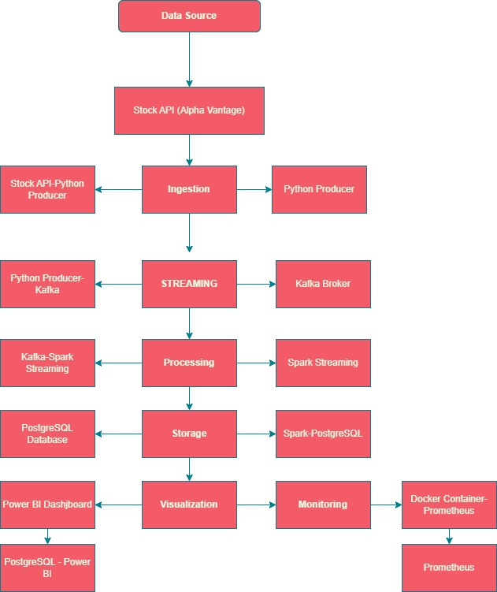
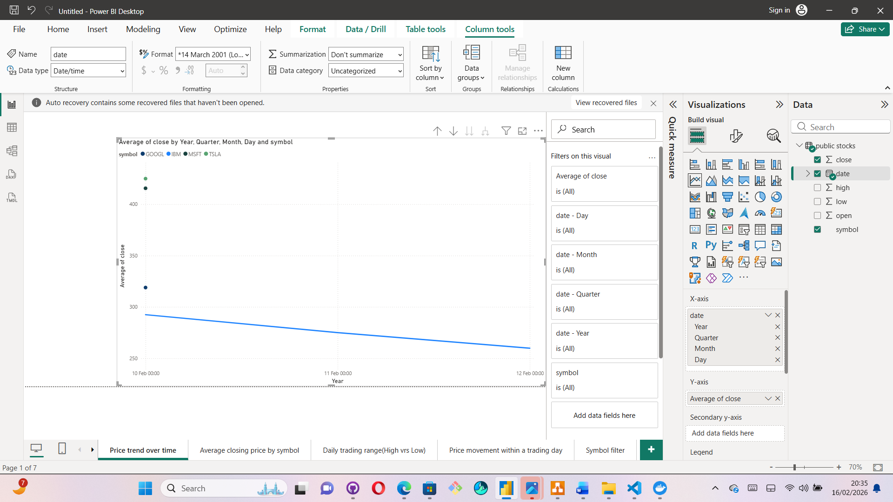

## Project Name: Real Time Stock Market Analysis
Project Overview
This project implements an end-to-end real-time stock market data pipeline that collects stock price data from an external API, streams it through Kafka, processes it using Spark Streaming, stores it in PostgreSQL, and visualises insights using Power BI.
All services are containerised with Docker to ensure portability, reproducibility, and easy deployment.
The goal of this project is to demonstrate real-time data engineering concepts, including streaming pipelines, distributed processing, database storage, monitoring, and visualisation.
 All components are containerized with Docker for easy deployment.

 ### Data Pipeline Architecture
 

 The pipeline follows this flow:
API → Python Producer → Kafka → Spark Streaming → PostgreSQL → Power BI Dashboard
Monitoring is handled using Prometheus and Docker container metrics.
Tech Stack
Data Source
•	Alpha Vantage Stock API
Ingestion
•	Python
•	Kafka Producer
Streaming
•	Apache Kafka
Processing
•	Apache Spark Streaming
Storage
•	PostgreSQL

Visualisation
•	Power BI
Monitoring
•	Prometheus
•	Docker
DevOps
•	Docker Compose
Project Structure
How the Pipeline Works
Step 1 — Data Extraction
The Python producer fetches stock data from the Alpha Vantage API.

Step 2 — Streaming
The producer sends JSON stock events into Kafka topics.
Step 3 — Processing
Spark Streaming consumes Kafka messages and performs transformations.
Step 4 — Storage
Processed data is written into a PostgreSQL database.
Step 5 — Visualisation
Power BI connects to PostgreSQL to display stock insights.
[PostgresSQL](_img/Postgres_table.png)
Step 6 — Monitoring
Prometheus monitors container health and system metrics.

Running the Project
1. Clone the repository
git clone https://github.com/<your-username>/Real-Time-Stock-Market-Analysis.git
cd Real-Time-Stock-Market-Analysis

2. Start Docker services
docker-compose up -d

3. Run the producer
python producer/extract.py

4. Start the consumer
python consumer/consumer.py

Dashboard and Visualisation
Power BI is used as the visualisation layer of the pipeline.
The dashboard includes:
•	Price trend over time
•	Average closing price by symbol
•	Daily trading range (High vs Low)
•	Intraday price movement
•	Symbol filter
These visuals prove that the pipeline is working end-to-end.
[Power BI visuals](_img/Price%20Movement%20Within%20Trading%20Day-Power%20BI.png)

-Power%20BI.png)

Monitoring
Prometheus is configured to monitor system metrics and Docker containers.
You can access Prometheus at:
http://localhost:9090
Example query:
up

Learning Outcomes
This project proves:
•	Real-time data ingestion
•	Kafka streaming pipelines
•	Spark streaming processing
•	PostgreSQL integration
•	Docker orchestration
•	Monitoring with Prometheus
•	Data visualisation with Power BI

Future Improvements
•	Add Kafka schema registry
•	Deploy pipeline to cloud infrastructure
•	Add alerting with Grafana
•	Implement CI/CD pipeline
•	Add data validation layer

Author
Kwabena Agyei Asamoah

Project Tech Stack and Flow
  - `Kafka UI → inspect topics/messages.`
  - `API → produces JSON events into Kafka.`
  - `Spark → consumes from Kafka, writes to Postgres.`
  - `Postgres → stores results for analytics.`
  - `pgAdmin → manage Postgres visually.`
  - `Power BI → external (connects to Postgres database).`
  Testing GitHub commit
  